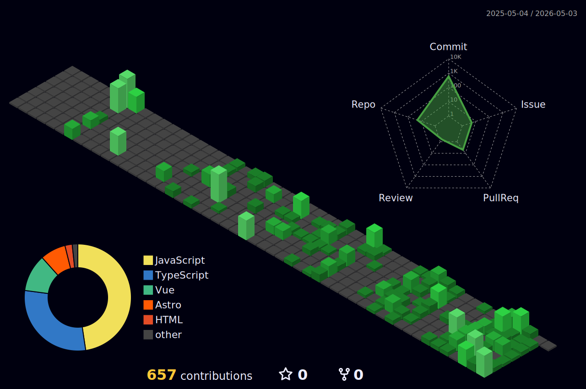

<h1 style="text-align: center">RynT</h1>

Frontend developer / CS student  
Focused on **global frontend ecosystem** and **UI/UX Design**.

## Coding Activity

<table>
  <tr>
    <td>
      
    </td>
    <td>
      
    </td>
  </tr>
</table>

---

> Time passes, code remains. Each commit is a stroke on the canvas of my youth. Stay sober while striving for better answers.
